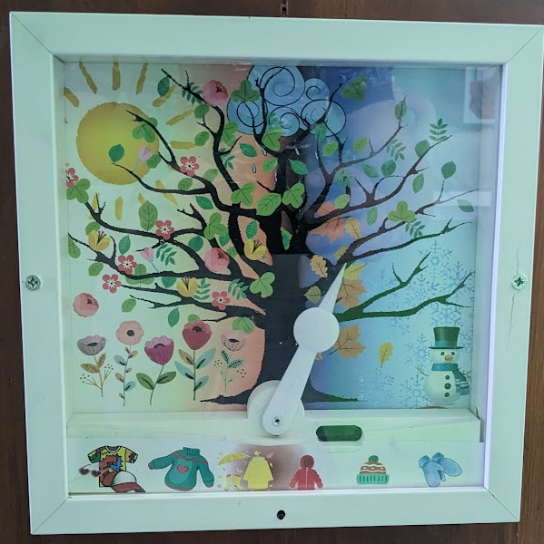

# KitaWetterstation
Weather station with animations for kindergarden.
This video shows the weather station in action: https://youtu.be/sKCQWrAyeEQ
The 3d model files are also on thingiverse: https://www.thingiverse.com/thing:6057646

# Function
A press on the button wakes the ESP32 from deep sleep. It connects to wifi, and displays an animation with the LEDs and pointer. After wifi is established, the DWD weather API is queried for the current local weather information. This information is evaluated into 5 categories, mainly on temperature and rainfall. The category is displayed with the pointer, and corresponding clothing lights up. The OLED display also shows the weather information with an icon, and the exact temperature. Further it used to display battery state and issues, such as problems with the wifi connection. 
The device is battery operated. The battery is expected to run about 1 week before it needs recharging with a USB charger. 

# Implementation
The project is implemented in micropython, with asyncio to facilitate processing of concurrent tasks. For the first use, I implemented a function save_wifi(ssid, pw) to setup a wifi connection to an access point. This creates a file credentials.txt storing this information. 

# Components
* Ikea Frame SANNAHED 25x25 cm
* 3d printed base to hold the motor and hide the electronics in the frame. 
* Artwork for the background and the clothing items to light up. 
* ESP32 dev board with battery charging circuit and low standby current. I used TTGO T7
* SG90 Hobby servo motor.
* 6 LEDs of a RGB Neopixel stripe 
* I2C oled display 0.92'', 128X32 pixel.
* 1000 mAh lithium ion battery 
* tactile button
* some mosfets to reduce standby current of LEDs and Motor. I used IRLML6344 and SI2305 for a high side switch. Since these are SOT-23 SMD components I used adapter PCBs to integrate them in the circuit. 